# Foundry Pattern Library — "From AI Gateway to AI Factory"

Twelve runnable Microsoft Foundry patterns, told through **one Private Banking scenario**
(a wealth-management Relationship Manager assistant), and positioned to run **alongside
your existing gateway and cloud** — not instead of them.

## The story

> **Build in GitHub → Run & optimize in Foundry → Reach users in M365.**
> A gateway gives you **model access**. Foundry gives you the **agent factory** — the
> runtime (Plan/Act/Observe), grounding (Microsoft IQ), identity, evaluation, tracing and
> safety plane *around* the models. **Keep your gateway (LiteLLM · APIM · or your own). Keep your existing cloud. Add the factory.**

Close on the Build 2026 triad: **Foundry** (platform) + **Citadel** (governance at scale,
Foundry + APIM) + **Agentic Patterns** (business value).

## Reuse for any customer

This is a **general-purpose Foundry pattern library**, not a pitch against any one vendor.
To run it for a different customer, swap three variables — the patterns don't change:

- **Gateway** — LiteLLM, Azure APIM, or their own (the demo gateway here is Azure APIM).
- **Other cloud / providers** — AWS Bedrock is the running *example* in Pattern 9; swap in whatever they run.
- **Scenario** — Private Banking is the default narrative; any industry works (the agent
  instructions and golden set are the only per-scenario bits).

See [`docs/coexistence.md`](docs/coexistence.md) for the "coexist with what they already have" story.

## Architecture at a glance

Foundry plugs in **behind** your gateway as just another provider — keyless via Entra ID —
then adds the factory plane (runtime, grounding, identity, eval, tracing, safety) the models alone don't give you.

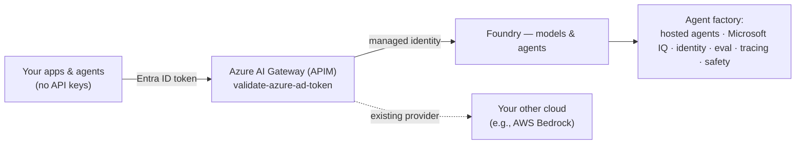

## What's inside

Twelve patterns in four groups. The numbers are the run order; the groups are how to *think*
about them — each answers a different question, and you can enter at whichever one the customer
is actually asking about.

### Control plane — make the gateway the single front door

| # | Folder | Pattern | Live demo move | Runnable? |
|---|--------|---------|----------------|-----------|
| 1 | `01-wedge/` | Wedge → AI Hub Gateway / Citadel | Foundry as a provider *behind* your Azure AI Gateway (APIM) | ✅ |
| 8 | `08-governance/` | Governance / Prompt Shields | Block a live jailbreak + XPIA injection; clean question passes (**live, keyless**) | ✅ |

### Agent factory — build the agent

| # | Folder | Pattern | Live demo move | Runnable? |
|---|--------|---------|----------------|-----------|
| 2 | `02-agent-service/` | Agent Service | Two hosting models — prompt-based (managed vector store + function tool) and a real BYO-code hosted agent — both with an Entra Agent ID | ✅ |
| 3 | `03-microsoft-iq/` | Microsoft IQ — the grounding layer | Web IQ published as **our own MCP API on APIM** — the gateway authenticates the caller, holds the Web IQ key and meters every tool call. Foundry IQ is the enterprise half; Fabric IQ and Work IQ complete the family | ✅ |
| 4 | `04-agentic-loop/` | Agentic Loop — "Build Skills, Not Agents" | [skill-forge](https://github.com/SridharArrabelly/skill-forge): one loop, N skills; switch to **Copilot SDK BYOM** | ✅ (skill-forge) |
| 10 | `10-memory/` | Memory — short-term + long-term | Same session recall (Conversations) **and** cross-session recall from a per-user Memory Store (keyless, preview) | ✅ |

### Orchestration & interop — make agents work together

| # | Folder | Pattern | Live demo move | Runnable? |
|---|--------|---------|----------------|-----------|
| 5 | `05-multi-agent/` | Multi-agent orchestration | **Agent Framework**: orchestrator + 2 specialists | ✅ |
| 9 | `09-aws-interop/` | Cross-cloud interop — bring your other cloud | Foundry agent → external tool over MCP/A2A (AWS Lambda + Bedrock as the example) (**slide + code walkthrough**) | 📖 code |

### Operate & optimise — run it in production

| # | Folder | Pattern | Live demo move | Runnable? |
|---|--------|---------|----------------|-----------|
| 6 | `06-observability/` | Observability & tracing | Same OpenTelemetry trace in **both** the Foundry portal *Tracing* tab **and** App Insights — and, with BYOM, the same call in the gateway metrics | ✅ |
| 7 | `07-evaluations/` | Evaluation → optimization | Scorecard + CI gate; a wrong row fails the gate | ✅ |
| 11 | `11-caching-cost/` | Caching & Cost | Prompt-cache hit on the repeat call (cached tokens) + Model Router downshift, through the gateway | ✅ |
| 12 | `12-agent365-roi/` | Agent 365 & ROI | Cost ↔ outcome ↔ ROI table from live agent runs; Agent 365 adds org-wide inventory/identity/policy | ✅ |

### The gateway thread

Control isn't one pattern — it runs through three planes, each routed a different way:

| Plane | What calls out | Pattern |
| --- | --- | --- |
| **Client** | your app / SDK | 1 — call the gateway URL |
| **Agent** | Foundry, server-side, mid-run | 2, 6 — **BYOM** model connection |
| **Tool** | the agent's MCP tools | 3 — the tool published as an APIM MCP API |

Patterns 7 and 10 stay on the direct route on purpose — see
[`docs/coexistence.md`](docs/coexistence.md) for why.

Every pattern folder has a `TALK-TRACK.md` — the 60-second script + "what it beats in a
homegrown factory." Plus [`docs/coexistence.md`](docs/coexistence.md) for coexisting with an
existing gateway, cloud, or agents.

## Pattern diagrams

One architecture per pattern — the same diagrams that appear on each slide of
`foundry-patterns.pptx`.

### 1 · Wedge → AI Hub Gateway / Citadel
Keyless via Entra ID — 401 without a token, 200 with. Foundry sits beside your existing providers behind the gateway.

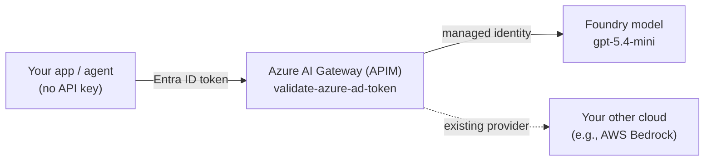

### 2 · Agent Service
**Two ways to run an agent on Foundry**, same Private Banking scenario, both with a
governable Entra Agent ID — see [`02-agent-service/`](02-agent-service/):
- **A. Prompt-based** (`create_prompt_agent.py`) — declarative: model + instructions + tools.
  Managed **vector store** (File Search RAG) + a **function tool**, created with the new
  unified SDK (`AIProjectClient.agents.create_version(PromptAgentDefinition(...))`) and
  invoked via the **Responses** API. A first-class *versioned* agent in the portal.
- **B. Hosted (BYO code)** ([`hosted/`](02-agent-service/hosted/)) — your **Agent
  Framework** container, run by Foundry on managed compute, with its own **dedicated**
  Entra Agent ID and endpoint (Responses protocol on `:8088`).

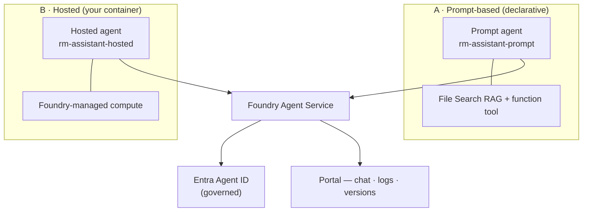

### 3 · Microsoft IQ — the grounding layer
Microsoft IQ is four layers: **Web IQ** (live web), **Foundry IQ** (enterprise knowledge),
**Fabric IQ** (business data and KPIs) and **Work IQ** (M365 org context). This pattern runs
**Web IQ** live, published as **our own MCP API on APIM** — the gateway authenticates the
caller, injects the Web IQ key from a secret it holds, and meters every tool call, so no Web
IQ credential ever sits client-side. Foundry IQ is the enterprise half of the same story.
Fabric IQ and Work IQ complete the family and are dashed below: real layers, not wired up here.

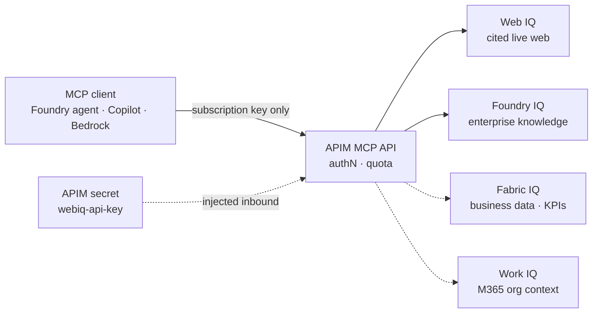

### 4 · Agentic Loop — Build Skills, Not Agents
One Plan/Act/Observe loop, N skills-as-folders; swap the engine to Copilot SDK BYOM.

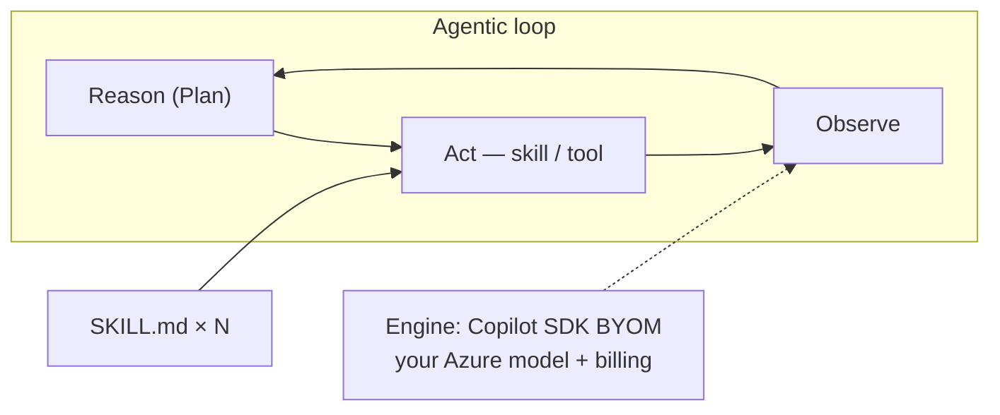

### 5 · Multi-agent Orchestration (Agent Framework)
Fan out to specialists concurrently, then aggregate — Compliance can return BLOCK.

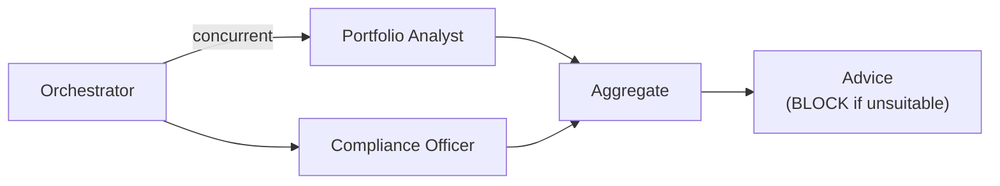

### 6 · Observability & Tracing
Create a **real Foundry agent**, run one traced turn, and the same OTel trace lands in the Foundry portal (Agents + Tracing) **and** App Insights — portable, no lock-in.

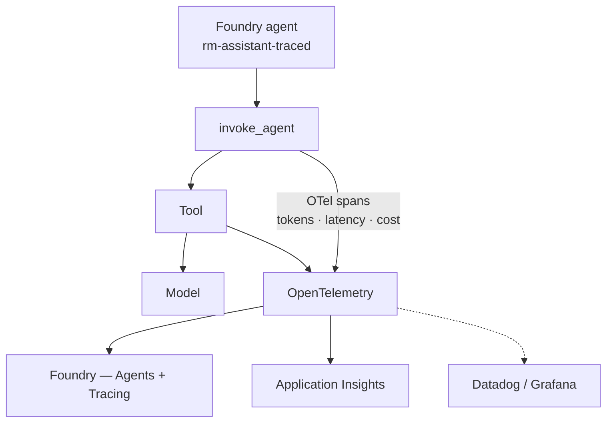

### 7 · Evaluation → Optimization
Score the golden set in **Foundry's cloud eval service**; a wrong "suitable" answer fails groundedness and the CI gate blocks the PR. Results show in the terminal *and* the Foundry **Evaluations** tab.

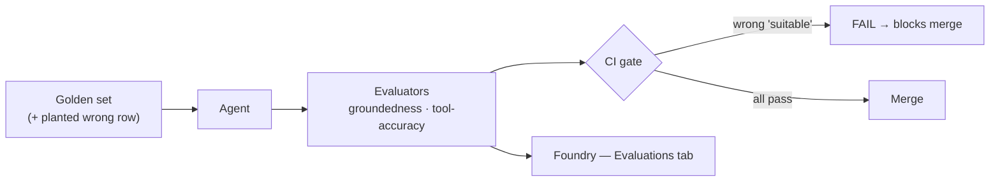

### 8 · Governance / Prompt Shields / Content Safety
Prompt Shields blocks a direct jailbreak and an injection hidden in a client document, while a clean question passes — **live and keyless** on the Foundry AI Services account (no separate resource).

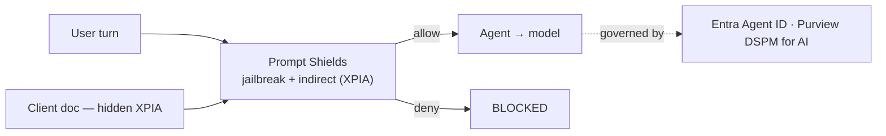

### 9 · Cross-cloud Interop — bring your other cloud
A Foundry agent calls an external tool over MCP (an AWS Lambda in this example); A2A hands off to another cloud's agent (Bedrock here). Swap in whatever the customer runs.

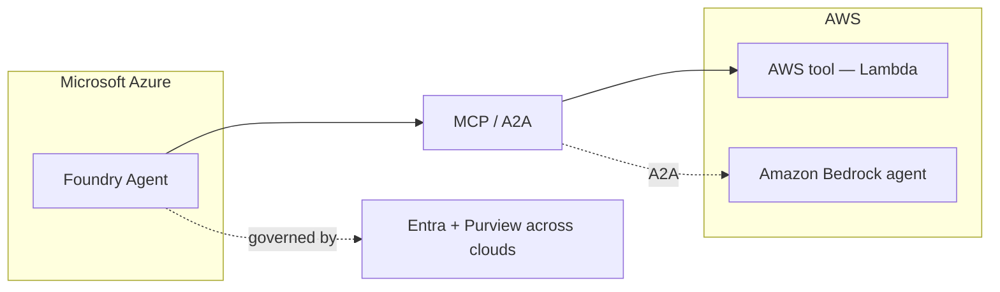

### 10 · Memory — short-term + long-term
Short-term = a Conversation (recall inside one session). Long-term = a per-user Memory Store (recall across sessions). Keyless; you didn't build a state store or a vector DB.

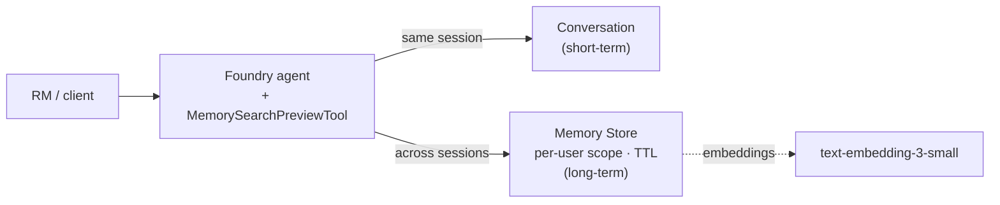

### 11 · Caching & Cost
Two cost layers: model-side prompt caching (identical prefix) and gateway semantic cache (equivalent prompts), plus Model Router picking the cheapest capable model.

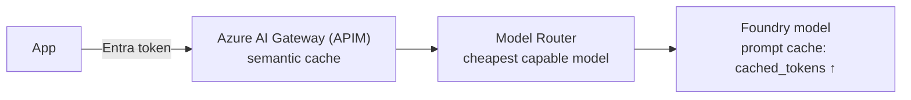

### 12 · Agent 365 & ROI
Every agent is an identity you can inventory and a cost you can tie to an outcome — governance and FinOps in one plane.

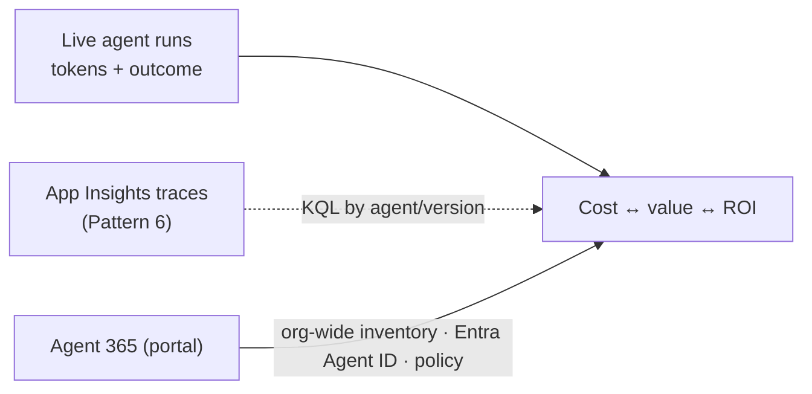

## Setup (uv)

```powershell
cp .env.example .env      # values are pre-filled for the Foundry project
uv sync                   # resolves Python 3.12 + deps automatically
az login                  # Entra ID auth (DefaultAzureCredential) — gateway + Foundry
```

Auth is **Entra ID / keyless** everywhere: the gateway client (Pattern 1/5) and the
Foundry project both use `DefaultAzureCredential`, so `az login` is all you need. Set
keys in `.env` only if you prefer key-based fallback.

> **Multi-tenant tip:** `.env` pins `AZURE_TENANT_ID` to the Foundry resource's tenant.
> If you're signed into more than one tenant, this stops `DefaultAzureCredential` from
> grabbing a token for the wrong one (a "token tenant does not match resource tenant"
> error the eval workers in Pattern 7 are sensitive to). Tenant IDs aren't secrets.

Run any pattern:

```powershell
uv run python 01-wedge/call_gateway.py
uv run python 02-agent-service/create_prompt_agent.py
# ... etc
```

Patterns 3 + 4 run from the **[skill-forge](https://github.com/SridharArrabelly/skill-forge)**
repo (clone it next to this one as `../skill-forge`): `uv run skill-forge`,
then use the engine selector (hand-rolled loop → Copilot SDK → Copilot SDK BYOM → Agent
Framework) and the skill chips.

## Suggested run-of-show

| Index | Pattern |
|-------|---------|
| 1 | Wedge → AI Hub Gateway / Citadel |
| 2 | Agent Service |
| 3 | Microsoft IQ — the grounding layer |
| 4 | Agentic Loop (Build Skills, Not Agents) |
| 5 | Multi-agent (Agent Framework) |
| 6 | Observability & tracing (OpenTelemetry) |
| 7 | Evaluation → optimization (CI gate) |
| 8 | Governance / Prompt Shields / Content Safety |
| 9 | AWS cross-cloud interop (MCP / A2A) |
| 10 | Memory (Short-term & Long-term) |
| 11 | Caching & Cost |
| 12 | Agent 365 & ROI |
| — | Q & A |

## Live-demo safety
- **Pre-run every script once** and keep terminal output / portal screenshots as fallback.
- Keep the Foundry portal **Agents** (versioned `rm-assistant-prompt`) and **Tracing** tabs pre-opened.
- Secrets live in `.env`, never on screen.
