# Microsoft Foundry Patterns

**Runnable patterns for building, governing and operating agents.**

Twelve of them, told through **one Private Banking scenario**
(a wealth-management Relationship Manager assistant), and positioned to run **alongside
your existing gateway and cloud** — not instead of them.

Each pattern is a folder you can run on its own against your own Foundry project. Nothing
here is a mock: if a capability isn't wired up, the pattern says so rather than pretending.

> This is a community sample, **not an official Microsoft product**, and is not endorsed by
> or supported by Microsoft. Microsoft product names and marks belong to Microsoft; see
> [`CONTRIBUTING.md`](CONTRIBUTING.md) for the trademark notice.

## Getting started

You'll need an [Azure subscription](https://azure.microsoft.com/free/), a
[Microsoft Foundry project](https://learn.microsoft.com/azure/ai-foundry/how-to/create-projects)
with a chat model deployed, and [uv](https://docs.astral.sh/uv/).

```powershell
cp .env.example .env      # then fill in your own Foundry project endpoint
uv sync                   # resolves Python 3.12 + deps automatically
az login                  # Entra ID auth (DefaultAzureCredential)
```

Then run any pattern:

```powershell
uv run python 01-wedge/call_gateway.py
uv run python 02-agent-service/create_prompt_agent.py
uv run python 03-microsoft-iq/microsoft_iq.py
# ... etc
```

Auth is **Entra ID / keyless** everywhere: the gateway client and the Foundry project both
use `DefaultAzureCredential`, so `az login` is all you need. Set keys in `.env` only if you
prefer a key-based fallback.

Not every pattern is self-contained. **Pattern 4** runs from the companion
**[skill-forge](https://github.com/SridharArrabelly/skill-forge)** repo (clone it alongside
this one as `../skill-forge`), and **Pattern 9** is a code walkthrough rather than a live
call. The table below marks which is which.

> **Multi-tenant tip:** `.env` pins `AZURE_TENANT_ID` to your Foundry resource's tenant.
> If you're signed into more than one tenant, this stops `DefaultAzureCredential` from
> grabbing a token for the wrong one (a "token tenant does not match resource tenant"
> error the eval workers in Pattern 7 are sensitive to). Tenant IDs aren't secrets.

## The story

> **Build in GitHub → Run & optimize in Foundry → Reach users in M365.**
> A gateway gives you **model access**. Foundry gives you the **agent factory** — the
> runtime (Plan/Act/Observe), grounding (Microsoft IQ), identity, evaluation, tracing and
> safety plane *around* the models. **Keep your gateway (LiteLLM · APIM · or your own). Keep your existing cloud. Add the factory.**

Close on the Build 2026 triad: **Foundry** (platform) + **Citadel** (governance at scale,
Foundry + APIM) + **Agentic Patterns** (business value).

## Adapting it

This is a **general-purpose Foundry pattern library**, not a pitch against any one vendor.
To retell it for a different context, swap three variables — the patterns don't change:

- **Gateway** — LiteLLM, Azure APIM, or your own (the gateway used here is Azure APIM).
- **Other cloud / providers** — AWS Bedrock is the running *example* in Pattern 9; swap in
  whatever you already run.
- **Scenario** — Private Banking is the default narrative; any industry works (the agent
  instructions and golden set are the only per-scenario bits).

See [`docs/coexistence.md`](docs/coexistence.md) for coexisting with what you already have.

## Architecture at a glance

Foundry plugs in **behind** your gateway as just another provider — keyless via Entra ID —
then adds the factory plane (runtime, grounding, identity, eval, tracing, safety) the models alone don't give you.

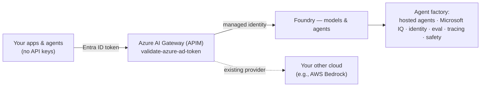

## What's inside

Twelve patterns in four groups. Each group answers a different question, so you can start
with whichever one matches the problem in front of you. The deck and the run-of-show below
walk the groups in order; the numbers are just stable folder IDs.

### Control plane — make the gateway the single front door

| # | Folder | Pattern | Live demo move | Runnable? |
|---|--------|---------|----------------|-----------|
| 1 | `01-wedge/` | Wedge → AI Hub Gateway / Citadel | Foundry as a provider *behind* your Azure AI Gateway (APIM) | ✅ |
| 8 | `08-governance/` | Governance (Prompt Shields + Content Safety) | Block a live jailbreak + XPIA injection; clean question passes (**live, keyless**) | ✅ |

### Agent factory — build the agent

| # | Folder | Pattern | Live demo move | Runnable? |
|---|--------|---------|----------------|-----------|
| 2 | `02-agent-service/` | Agent Service (prompt and hosted agent) | Two hosting models — prompt-based (managed vector store + function tool) and a real BYO-code hosted agent — both with an Entra Agent ID | ✅ |
| 3 | `03-microsoft-iq/` | Microsoft IQ — the intelligence layer | Web IQ published as **our own MCP API on APIM** — the gateway authenticates the caller, holds the Web IQ key and meters every tool call. Foundry IQ, Fabric IQ and Work IQ complete the family (narrated, not wired) | ✅ |
| 13 | `12-toolbox/` | Centralized Toolboxes (one governed MCP endpoint) | Curate tools once behind **one MCP endpoint**; promote a new version and every agent follows with no redeploy. **Tool search** collapses N tool definitions to 2 meta-tools | ✅ |
| 4 | `04-agentic-loop/` | Agentic Loop (build skills, not agents) | [skill-forge](https://github.com/SridharArrabelly/skill-forge): one loop, N skills; switch to **Copilot SDK BYOM** | ✅ (skill-forge) |
| 10 | `10-memory/` | Memory (short-term + long-term) | Same session recall (Conversations) **and** cross-session recall from a per-user Memory Store (keyless, preview) | ✅ |

### Orchestration & interop — make agents work together

| # | Folder | Pattern | Live demo move | Runnable? |
|---|--------|---------|----------------|-----------|
| 5 | `05-multi-agent/` | Multi-agent orchestration (Agent Framework) | **Agent Framework**: orchestrator + 2 specialists | ✅ |
| 9 | `09-aws-interop/` | Cross-cloud interop (MCP / A2A) | Foundry agent → external tool over MCP/A2A (AWS Lambda + Bedrock as the example) (**slide + code walkthrough**) | 📖 code |

### Operate & optimise — run it in production

| # | Folder | Pattern | Live demo move | Runnable? |
|---|--------|---------|----------------|-----------|
| 6 | `06-observability/` | Observability & tracing (OpenTelemetry) | Same OpenTelemetry trace in **both** the Foundry portal *Tracing* tab **and** App Insights — and, with BYOM, the same call in the gateway metrics. Cost per agent and version is a KQL query on the same spans | ✅ |
| 7 | `07-evaluations/` | Evaluation → optimization (CI gate) | Scorecard + CI gate; a wrong row fails the gate | ✅ |
| 11 | `11-caching-cost/` | Cost & latency (prompt cache + Model Router) | Prompt-cache hit on the repeat call (cached tokens, ~4× faster) + Model Router downshift, through the gateway | ✅ |

### The gateway thread

Control isn't one pattern — it runs through three planes, each routed a different way:

| Plane | What calls out | Pattern |
| --- | --- | --- |
| **Client** | your app / SDK | 1 — call the gateway URL |
| **Agent** | Foundry, server-side, mid-run | 2, 6 — **BYOM** model connection |
| **Tool** | the agent's MCP tools | 3 — the tool published as an APIM MCP API |

Patterns 7 and 10 stay on the direct route on purpose — see
[`docs/coexistence.md`](docs/coexistence.md) for why.

Every pattern folder has a `TALK-TRACK.md` — a short narrative for the pattern plus what
Foundry gives you there. Plus [`docs/coexistence.md`](docs/coexistence.md) for coexisting with an
existing gateway, cloud, or agents.

## Pattern diagrams

One architecture per pattern — the same diagrams that appear on each slide of
`foundry-patterns.pptx`.

### 1 · Wedge → AI Hub Gateway / Citadel
Keyless via Entra ID — 401 without a token, 200 with. Foundry sits beside your existing providers behind the gateway.

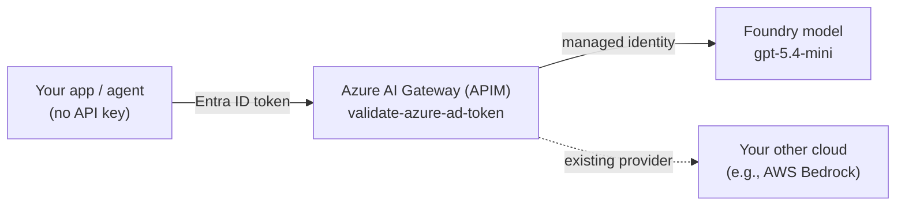

### 2 · Agent Service (prompt and hosted agent)
**Two ways to run an agent on Foundry**, same Private Banking scenario, both with a
governable Entra Agent ID — see [`02-agent-service/`](02-agent-service/):
- **A. Prompt-based** (`create_prompt_agent.py`) — declarative: model + instructions + tools.
  Managed **vector store** (File Search RAG) + a **function tool**, created with the new
  unified SDK (`AIProjectClient.agents.create_version(PromptAgentDefinition(...))`) and
  invoked via the **Responses** API. A first-class *versioned* agent in the portal.
- **B. Hosted (BYO code)** ([`hosted/`](02-agent-service/hosted/)) — your **Agent
  Framework** container, run by Foundry on managed compute, with its own **dedicated**
  Entra Agent ID and endpoint (Responses protocol on `:8088`).

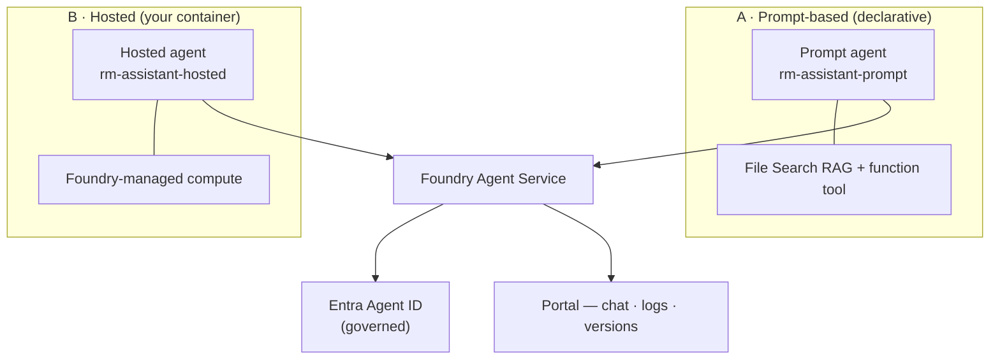

### 3 · Microsoft IQ — the intelligence layer
Microsoft IQ is the intelligence layer, in four parts: **Web IQ** (live web),
**Foundry IQ** (enterprise knowledge), **Fabric IQ** (business data and KPIs) and **Work IQ**
(M365 org context). This pattern runs
**Web IQ** live, published as **our own MCP API on APIM** — the gateway authenticates the
caller, injects the Web IQ key from a secret it holds, and meters every tool call, so no Web
IQ credential ever sits client-side. **Foundry IQ, Fabric IQ and Work IQ are narrated, not
wired up here** — they're dashed below: real layers of the same story, but this repo runs the
Web IQ leg only.

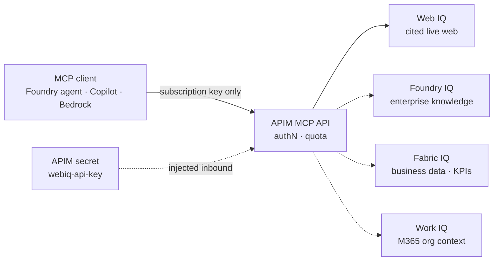

### 12 · Centralized Toolboxes (one governed MCP endpoint)
Curate tools once; every agent consumes them from one MCP endpoint. Versions are promoted
centrally, so the tool plane changes without redeploying an agent. **Tool search** hides N
tool definitions behind two meta-tools, so a toolbox scales without flooding the context
window. Pattern 3's APIM-governed Web IQ API can sit *inside* the toolbox — the gateway
still meters it.

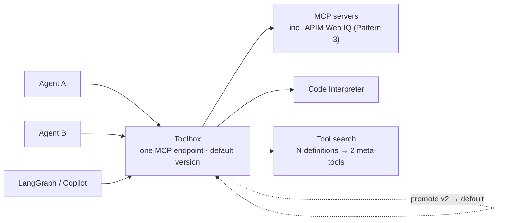

### 4 · Agentic Loop (build skills, not agents)
One Plan/Act/Observe loop, N skills-as-folders; swap the engine to Copilot SDK BYOM.

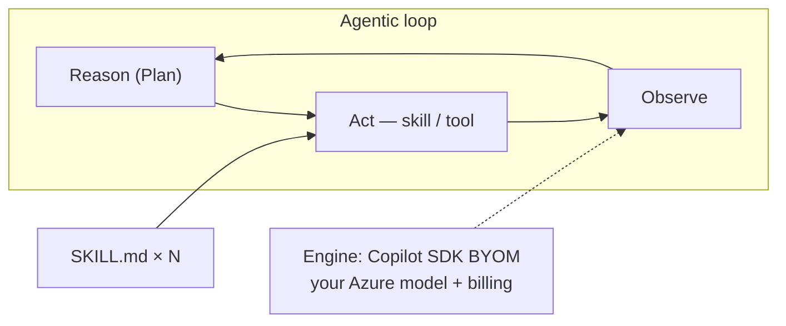

### 5 · Multi-agent orchestration (Agent Framework)
Fan out to specialists concurrently, then aggregate — Compliance can return BLOCK.

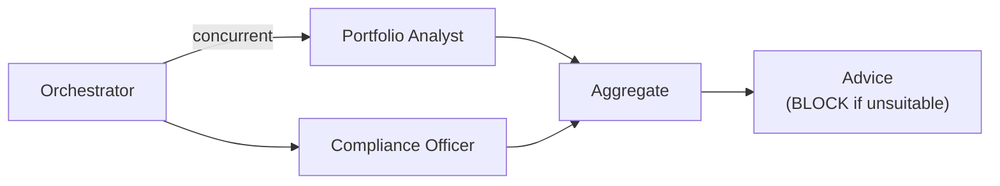

### 6 · Observability & tracing (OpenTelemetry)
Create a **real Foundry agent**, run one traced turn, and the same OTel trace lands in the Foundry portal (Agents + Tracing) **and** App Insights — portable, no lock-in.

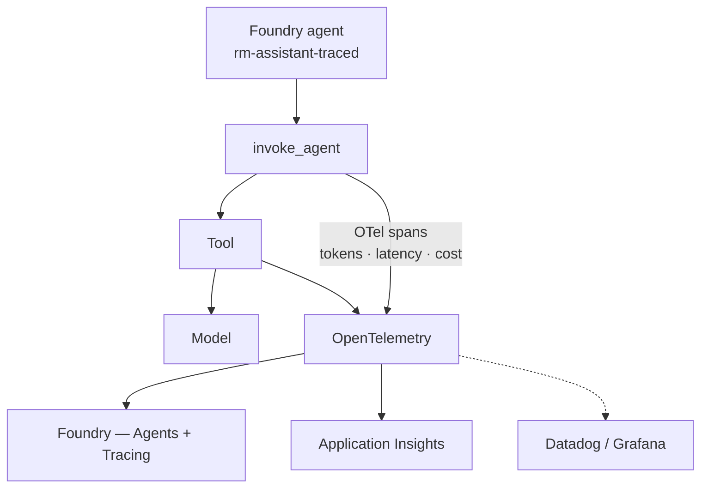

### 7 · Evaluation → optimization (CI gate)
Score the golden set in **Foundry's cloud eval service**; a wrong "suitable" answer fails groundedness and the CI gate blocks the PR. Results show in the terminal *and* the Foundry **Evaluations** tab.

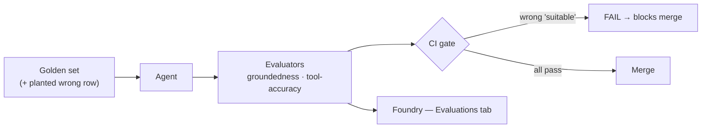

### 8 · Governance (Prompt Shields + Content Safety)
Prompt Shields blocks a direct jailbreak and an injection hidden in a client document, while a clean question passes — **live and keyless** on the Foundry AI Services account (no separate resource).

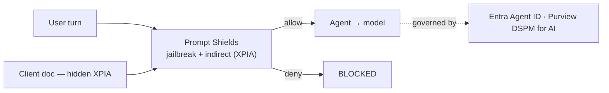

### 9 · Cross-cloud interop (MCP / A2A)
A Foundry agent calls an external tool over MCP (an AWS Lambda in this example); A2A hands off to another cloud's agent (Bedrock here). Swap in whatever the customer runs.

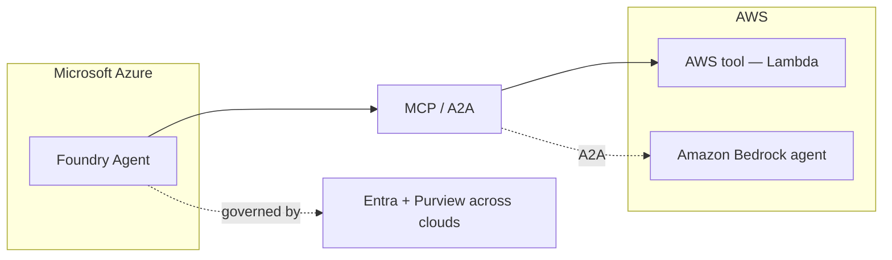

### 10 · Memory (short-term + long-term)
Short-term = a Conversation (recall inside one session). Long-term = a per-user Memory Store (recall across sessions). Keyless; you didn't build a state store or a vector DB.

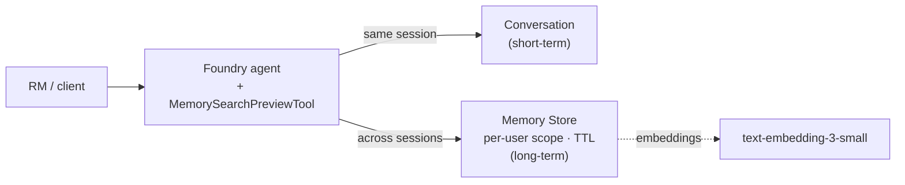

### 11 · Cost & latency (prompt cache + Model Router)
Two cost layers: model-side prompt caching (identical prefix) and gateway semantic cache (equivalent prompts), plus Model Router picking the cheapest capable model.

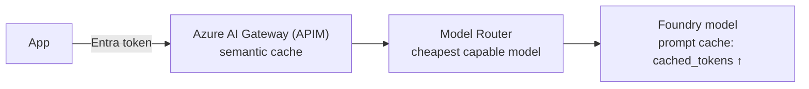

## Suggested run-of-show

Walked group by group — the same order as `foundry-patterns.pptx`. Pick the depth to suit
the room; the order is what matters.

| Group | # | Pattern |
|-------|---|---------|
| Control plane | 1 | Wedge → AI Hub Gateway / Citadel |
| Control plane | 8 | Governance (Prompt Shields + Content Safety) |
| Agent factory | 2 | Agent Service (prompt and hosted agent) |
| Agent factory | 3 | Microsoft IQ — the intelligence layer |
| Agent factory | 12 | Centralized Toolboxes (one governed MCP endpoint) |
| Agent factory | 4 | Agentic Loop (build skills, not agents) |
| Agent factory | 10 | Memory (short-term + long-term) |
| Orchestration & interop | 5 | Multi-agent orchestration (Agent Framework) |
| Orchestration & interop | 9 | Cross-cloud interop (MCP / A2A) |
| Operate & optimise | 6 | Observability & tracing (OpenTelemetry) |
| Operate & optimise | 7 | Evaluation → optimization (CI gate) |
| Operate & optimise | 11 | Cost & latency (prompt cache + Model Router) |
