# Microsoft Foundry Patterns

**Runnable patterns for building, governing and operating agents.**

Fifteen patterns: the original twelve retain **one Private Banking scenario**
(a wealth-management Relationship Manager assistant), while the three new enterprise
control patterns are industry-neutral. All are positioned to run **alongside your
existing gateway and cloud** — not instead of them.

Each pattern is a folder you can run on its own against your own Foundry project. Nothing
here is a mock: if a capability isn't wired up, the pattern says so rather than pretending.

> This is a community sample, **not an official Microsoft product**, and is not endorsed by
> or supported by Microsoft. Microsoft product names and marks belong to Microsoft; see
> [`CONTRIBUTING.md`](CONTRIBUTING.md) for the trademark notice.

## Getting started

You'll need an [Azure subscription](https://azure.microsoft.com/free/), a
[Microsoft Foundry project](https://learn.microsoft.com/azure/ai-foundry/how-to/create-projects)
with a chat model deployed, and [uv](https://docs.astral.sh/uv/).

```powershell
cp .env.example .env      # then fill in your own Foundry project endpoint
uv sync                   # resolves Python 3.12 + deps automatically
az login                  # Entra ID auth (DefaultAzureCredential)
```

Then run any pattern:

```powershell
uv run python 01-ai-gateway-model-access/call_gateway.py
uv run python 02-foundry-agent-service/create_prompt_agent.py
uv run python 03-microsoft-iq/microsoft_iq.py
# Governance/lifecycle examples:
uv run python 13-human-approval/run_approval_demo.py
uv run python 14-model-adaptation/adapt_model.py preflight --offline
uv run python 15-agent-lifecycle/lifecycle.py validate
```

Auth is **keyless-first**: Foundry project and Search access use
`DefaultAzureCredential`, and Pattern 1 uses Entra ID by default. The explicit exception is
Pattern 3's Web IQ route on **APIM Basic v2**, where the caller uses an APIM subscription key.
The separate upstream Web IQ credential remains on APIM and is never committed or sent to the
client.

Not every pattern is self-contained. **Pattern 4** runs from the companion
**[skill-forge](https://github.com/SridharArrabelly/skill-forge)** repo (clone it alongside
this one as `../skill-forge`), and **Pattern 9** is a code walkthrough rather than a live
call. The table below marks which is which.

> **Multi-tenant tip:** `.env` pins `AZURE_TENANT_ID` to your Foundry resource's tenant.
> If you're signed into more than one tenant, this stops `DefaultAzureCredential` from
> grabbing a token for the wrong one (a "token tenant does not match resource tenant"
> error the eval workers in Pattern 7 are sensitive to). Tenant IDs aren't secrets.

## The story

> **Build in GitHub → Run & optimize in Foundry → Reach users in M365.**
> A gateway gives you **model access**. Foundry gives you the **agent factory** — the
> runtime (Plan/Act/Observe), grounding (Microsoft IQ), identity, evaluation, tracing and
> safety plane *around* the models. **Keep your gateway (LiteLLM · APIM · or your own). Keep your existing cloud. Add the factory.**

Close on the Build 2026 triad: **Foundry** (platform) + **Citadel** (governance at scale,
Foundry + APIM) + **Agentic Patterns** (business value).

## Adapting it

This is a **general-purpose Foundry pattern library**, not a pitch against any one vendor.
To retell it for a different context, swap three variables — the patterns don't change:

- **Gateway** — LiteLLM, Azure APIM, or your own (the gateway used here is Azure APIM).
- **Other cloud / providers** — AWS Bedrock is the running *example* in Pattern 9; swap in
  whatever you already run.
- **Scenario** — Private Banking is the default narrative; any industry works (the agent
  instructions and golden set are the only per-scenario bits).

See [`docs/coexistence.md`](docs/coexistence.md) for coexisting with what you already have.

## Architecture at a glance

Foundry plugs in **behind** your gateway as just another provider — keyless via Entra ID —
then adds the factory plane (runtime, grounding, identity, approval, adaptation,
evaluation, tracing, safety and lifecycle) the models alone don't give you.

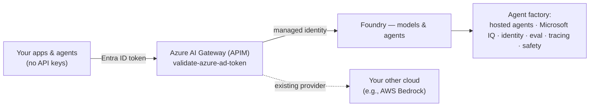

## What's inside

Fifteen patterns in four groups. Each group answers a different question, so you can start
with whichever one matches the problem in front of you. The deck and the run-of-show below
walk the groups in order; the numbers are just stable folder IDs.

### Platform foundation & governance

| # | Folder | Pattern | Live demo move | Runnable? |
|---|--------|---------|----------------|-----------|
| 1 | `01-ai-gateway-model-access/` | AI gateway & model access (APIM) | Foundry as a provider *behind* your Azure AI Gateway (APIM) | ✅ |
| 8 | `08-ai-safety/` | AI safety (Prompt Shields + Content Safety) | Block a live jailbreak + XPIA injection; clean question passes (**live, keyless**) | ✅ |
| 13 | `13-human-approval/` | Human approval for consequential tool actions | Read without interruption; reject with zero effects; approve once; replay stays exactly once | ✅ |

### Agent construction & knowledge

| # | Folder | Pattern | Live demo move | Runnable? |
|---|--------|---------|----------------|-----------|
| 2 | `02-foundry-agent-service/` | Foundry Agent Service (prompt and hosted agents) | Two hosting models — prompt-based (managed File Search/vector store + function tool) and a real BYO-code hosted agent — both with an Entra Agent ID | ✅ |
| 3 | `03-microsoft-iq/` | Microsoft IQ — the intelligence layer | Run **Web IQ through APIM** and a separate, real **Azure AI Search tool** path through a Foundry agent; broader IQ layers are narrated accurately | ✅ |
| 12 | `12-toolbox/` | Centralized Toolboxes (one governed MCP endpoint) | Curate tools once behind **one MCP endpoint**; promote a new version and every agent follows with no redeploy. **Tool search** collapses N tool definitions to 2 meta-tools | ✅ |
| 14 | `14-model-adaptation/` | Model adaptation (fine-tuning & evaluation) | Benchmark the base model, train reviewed stable behavior, evaluate the tuned deployment on the identical held-out set, and gate cleanup/promotion | ✅ |
| 10 | `10-memory/` | Memory (short-term + long-term) | Same session recall (Conversations) **and** cross-session recall from a per-user Memory Store (keyless, preview) | ✅ |

### Orchestration & interoperability

| # | Folder | Pattern | Live demo move | Runnable? |
|---|--------|---------|----------------|-----------|
| 4 | `04-agentic-loop/` | Agentic Loop (build skills, not agents) | [skill-forge](https://github.com/SridharArrabelly/skill-forge): one loop, N skills; switch to **Copilot SDK BYOM** | ✅ (skill-forge) |
| 5 | `05-multi-agent/` | Multi-agent orchestration (Agent Framework) | Concurrent specialists exposed through a [**Foundry-hosted Responses endpoint**](05-multi-agent/hosted/) | ✅ |
| 9 | `09-aws-interop/` | Cross-cloud interop (MCP / A2A) | Foundry agent → external tool over MCP/A2A (AWS Lambda + Bedrock as the example) (**slide + code walkthrough**) | 📖 code |

### Lifecycle, assurance & operations

| # | Folder | Pattern | Live demo move | Runnable? |
|---|--------|---------|----------------|-----------|
| 7 | `07-evaluation-release-gate/` | Evaluation & release gate | Generate candidate answers, score them in Foundry, and fail closed; an explicit demo mode plants a regression | ✅ |
| 6 | `06-observability/` | Observability & tracing (OpenTelemetry) | Metadata-only, Responses-capable OpenTelemetry spans in **both** Foundry *Tracing* and App Insights; prompt/completion bodies require explicit opt-in | ✅ |
| 11 | `11-caching-cost/` | Cost & latency (prompt cache + Model Router) | Prompt-cache hit on the repeat call (cached tokens, ~4× faster) + Model Router downshift, through the gateway | ✅ |
| 15 | `15-agent-lifecycle/` | Agent lifecycle & promotion (dev → test → prod) | Gate immutable versions across isolated projects; promote and roll back behind the same native stable endpoint without deleting state | ✅ |

### The gateway thread

Control isn't one pattern — it runs through three planes, each routed a different way:

| Plane | What calls out | Pattern |
| --- | --- | --- |
| **Client** | your app / SDK | 1 — call the gateway URL |
| **Agent** | Foundry, server-side, mid-run | 2, 6 — **BYOM** model connection |
| **Tool** | the agent's MCP tools | 3 — the tool published as an APIM MCP API |

Patterns 7 and 10 stay on the direct route on purpose — see
[`docs/coexistence.md`](docs/coexistence.md) for why.

Every pattern folder has a `TALK-TRACK.md` — a short narrative for the pattern plus what
Foundry gives you there. Plus [`docs/coexistence.md`](docs/coexistence.md) for coexisting with an
existing gateway, cloud, or agents.

## Pattern diagrams

One architecture per pattern — the same diagrams that appear on each slide of
`foundry-patterns.pptx`.

### 1 · AI gateway & model access (APIM)
Keyless via Entra ID by default — 401 without a token, 200 with. Foundry sits beside
existing providers behind the enterprise gateway.

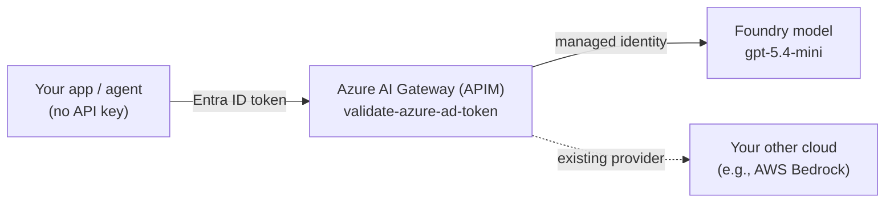

### 8 · AI safety (Prompt Shields + Content Safety)
Prompt Shields blocks a direct jailbreak and an injection hidden in a client document, while a clean question passes — **live and keyless** on the Foundry AI Services account (no separate resource).

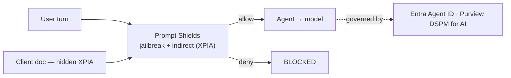

### 13 · Human approval for consequential tool actions
The prompt agent reads a change request without interruption. `schedule_change` is
configured with Foundry MCP `require_approval=always`, so the Responses API pauses on the
exact normalized tool name and arguments. A separate operator identity registers the
server-issued one-time nonce and records approve/reject; the tool credential cannot mint
decisions. Reject creates zero effects, approval creates one, and replay returns the same
effect ID.

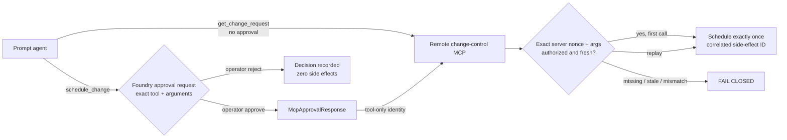

### 2 · Foundry Agent Service (prompt and hosted agents)
**Two ways to run an agent on Foundry**, same Private Banking scenario, both with a
governable identity lifecycle — see
[`02-foundry-agent-service/`](02-foundry-agent-service/):
- **A. Prompt-based** (`create_prompt_agent.py`) — declarative: model + instructions + tools.
  Managed **vector store** (File Search RAG) + a **function tool**, created with the new
  unified SDK (`AIProjectClient.agents.create_version(PromptAgentDefinition(...))`) and
  invoked via the **Responses** API. A first-class *versioned* agent in the portal.
- **B. Hosted (BYO code)** ([`hosted/`](02-foundry-agent-service/hosted/)) — your **Agent
  Framework** container, run by Foundry on managed compute, with its own **dedicated**
  Entra Agent ID and endpoint (Responses protocol on `:8088`).

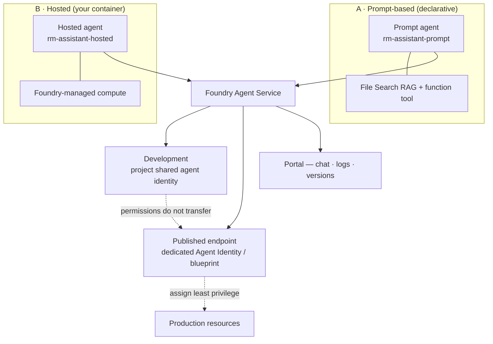

Identity determines the authorization and audit subject; human approval is a separate
runtime control. Attended/OBO calls use delegated user + agent authority, while
unattended/app-only calls use agent application authority. This sample does not claim a
live OBO proof.

### 3 · Microsoft IQ — the intelligence layer
This pattern runs **two live grounding implementations**:

- **Web IQ** through the existing APIM MCP route. APIM Basic v2 authenticates the caller with
  a subscription key, retains the separate upstream Web IQ credential, and meters each call.
- **Azure AI Search** through the official `AzureAISearchTool` on a versioned Foundry agent,
  using a project connection and `DefaultAzureCredential`, with cited enterprise content.

Pattern 2's managed File Search/vector store is deliberately not called Azure AI Search.
**Foundry IQ managed knowledge bases**, **Fabric IQ**, and **Work IQ** are broader product
layers and remain narrated, shown with dotted edges below.

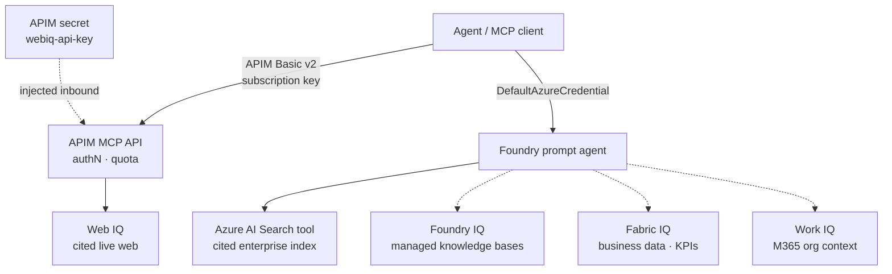

### 12 · Centralized Toolboxes (one governed MCP endpoint)
Curate tools once; every agent consumes them from one MCP endpoint. Versions are promoted
centrally, so the tool plane changes without redeploying an agent. **Tool search** hides N
tool definitions behind two meta-tools, so a toolbox scales without flooding the context
window. Pattern 3's APIM-governed Web IQ API can sit *inside* the toolbox by project
connection ID — the toolbox never reads the APIM key, and the gateway still meters it.

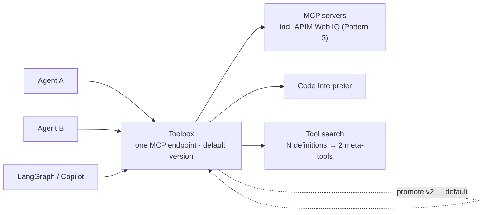

### 14 · Model adaptation (fine-tuning & evaluation)
Use RAG, Search or Foundry IQ for changing knowledge; prompt engineering for lightweight
instructions; and fine-tuning for stable task behavior, strict output format,
tool-selection patterns, or examples that do not fit the prompt. This runnable pipeline
benchmarks an opaque but stable routing taxonomy, validates reviewed train/validation
JSONL and a separate held-out set, runs current Foundry SFT, evaluates a temporary
Developer deployment on the identical test rows, gates measurable gain, and cleans up.

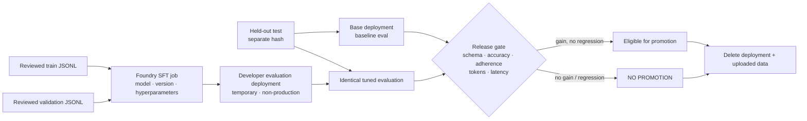

### 10 · Memory (short-term + long-term)
Short-term = a Conversation (recall inside one session). Long-term = a per-user Memory Store (recall across sessions). Keyless; you didn't build a state store or a vector DB.

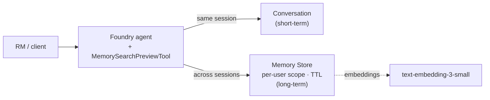

### 4 · Agentic Loop (build skills, not agents)
One Plan/Act/Observe loop, N skills-as-folders; swap the engine to Copilot SDK BYOM.

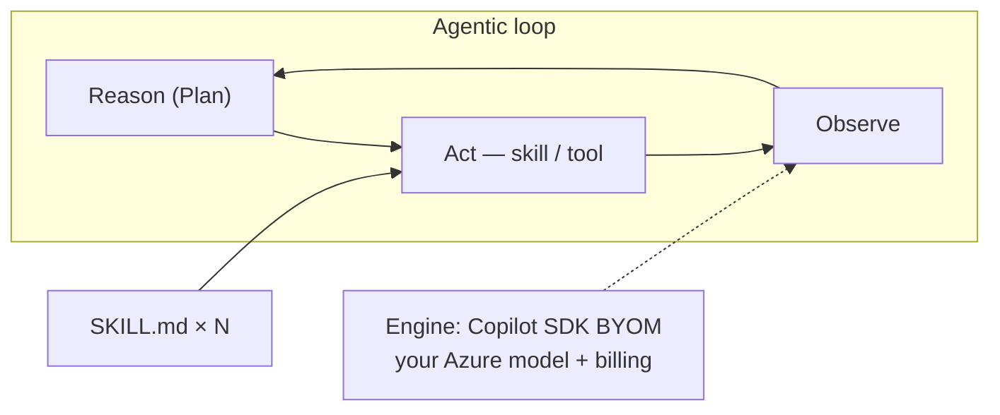

### 5 · Multi-agent orchestration (Agent Framework)
Fan out to specialists concurrently and return the fan-in result through a
Foundry-managed hosted-agent endpoint.

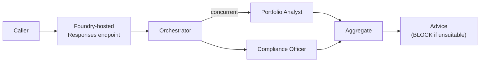

### 9 · Cross-cloud interop (MCP / A2A)
A Foundry agent calls an external tool over MCP (an AWS Lambda in this example); A2A hands off to another cloud's agent (Bedrock here). Swap in whatever the customer runs.

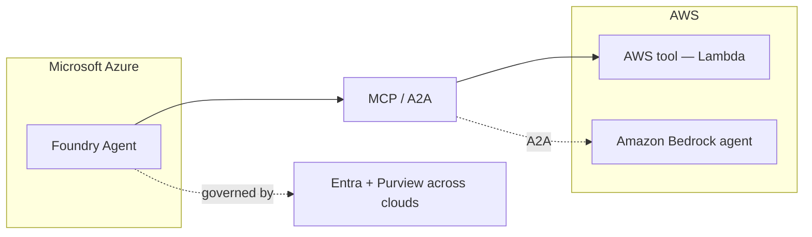

### 7 · Evaluation & release gate
Generate answers from the candidate prompt/model for every answer-free golden-set row, then
score those outputs in **Foundry's cloud eval service**. The default CI path can pass and
fails closed on unsuccessful runs, errored rows, missing metrics, or failed required metrics.
`--demo-failure` explicitly plants a wrong answer for the failure walkthrough.
The workflow is scoped to this sample's candidate instructions, model/dependency
configuration and evaluation fixtures—not arbitrary agents elsewhere in a repository.

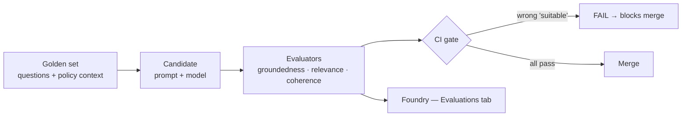

### 6 · Observability & tracing (OpenTelemetry)
Create a **real Foundry agent**, run one traced turn, and the same metadata-only OTel trace
lands in Foundry (Agents + Tracing) **and** App Insights. Agent, model, tool, token and latency
data is preserved by the SDK-native, Responses-capable `AIProjectInstrumentor`, including
trace-context propagation to Foundry, without exporting prompt/completion bodies by default.
Set `TRACE_CONTENT_RECORDING=true` only when telemetry access and retention are approved.

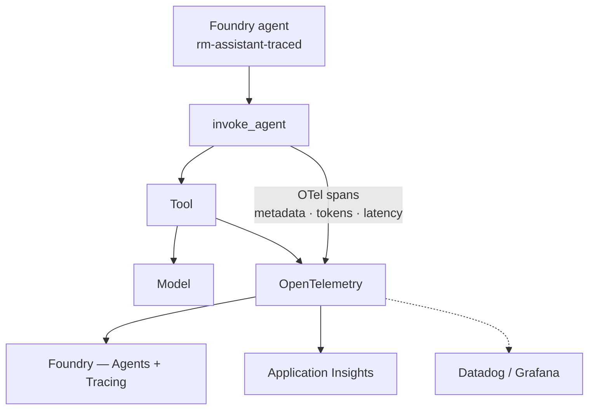

### 11 · Cost & latency (prompt cache + Model Router)
Two cost layers: model-side prompt caching (identical prefix) and gateway semantic cache (equivalent prompts), plus Model Router picking the cheapest capable model.

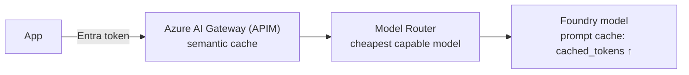

### 15 · Agent lifecycle & promotion (dev → test → prod)
The current agent object model owns the native stable endpoint, identity/blueprint,
immutable versions and selector; new automation does not use legacy Agent Applications.
The pipeline resolves source-controlled aliases, creates/smoke-tests dev and test
versions, runs a Pattern 7-style Foundry cloud gate, then pins a passing production
version behind the unchanged endpoint. Rollback repins the prior version and continues
the same stable-endpoint conversation without deleting state. New calls use the prior
version after routing converges; an existing conversation can retain version affinity,
which the signed rollback record captures explicitly.

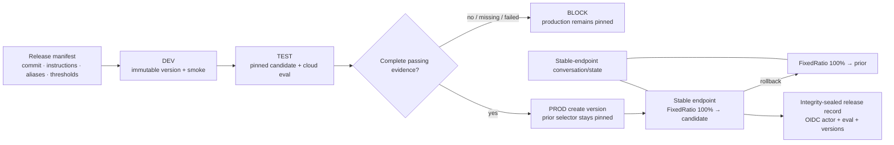

## Suggested run-of-show

Walked group by group — the same order as `foundry-patterns.pptx`. Pick the depth to suit
the room; the order is what matters.

| Group | # | Pattern |
|-------|---|---------|
| Platform foundation & governance | 1 | AI gateway & model access (APIM) |
| Platform foundation & governance | 8 | AI safety (Prompt Shields + Content Safety) |
| Platform foundation & governance | 13 | Human approval for consequential tool actions |
| Agent construction & knowledge | 2 | Foundry Agent Service (prompt and hosted agents) |
| Agent construction & knowledge | 3 | Microsoft IQ — the intelligence layer |
| Agent construction & knowledge | 12 | Centralized Toolboxes (one governed MCP endpoint) |
| Agent construction & knowledge | 14 | Model adaptation (fine-tuning & evaluation) |
| Agent construction & knowledge | 10 | Memory (short-term + long-term) |
| Orchestration & interoperability | 4 | Agentic Loop (build skills, not agents) |
| Orchestration & interoperability | 5 | Multi-agent orchestration (Agent Framework) |
| Orchestration & interoperability | 9 | Cross-cloud interop (MCP / A2A) |
| Lifecycle, assurance & operations | 7 | Evaluation & release gate |
| Lifecycle, assurance & operations | 6 | Observability & tracing (OpenTelemetry) |
| Lifecycle, assurance & operations | 11 | Cost & latency (prompt cache + Model Router) |
| Lifecycle, assurance & operations | 15 | Agent lifecycle & promotion (dev → test → prod) |
