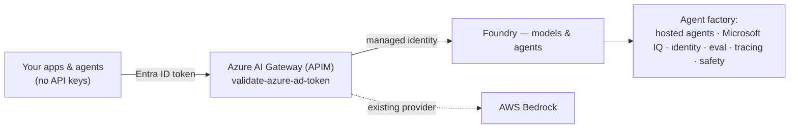
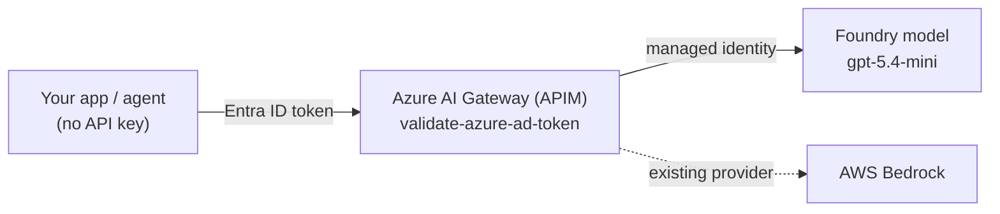
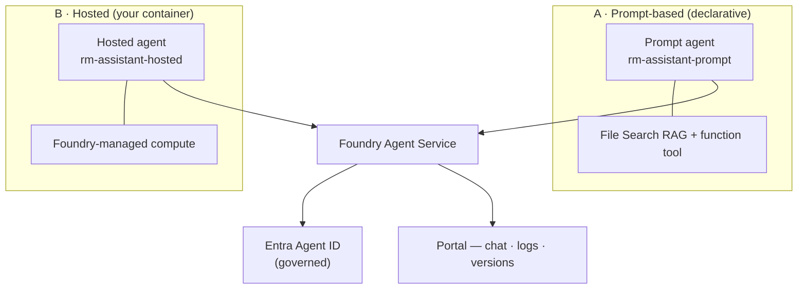
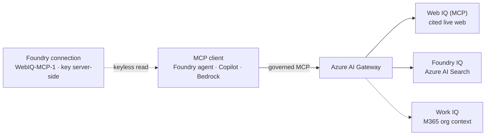
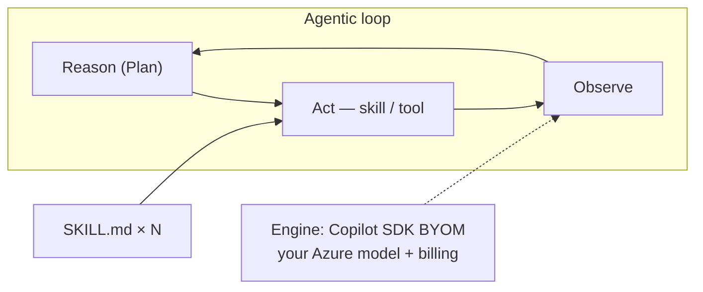
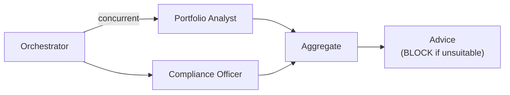
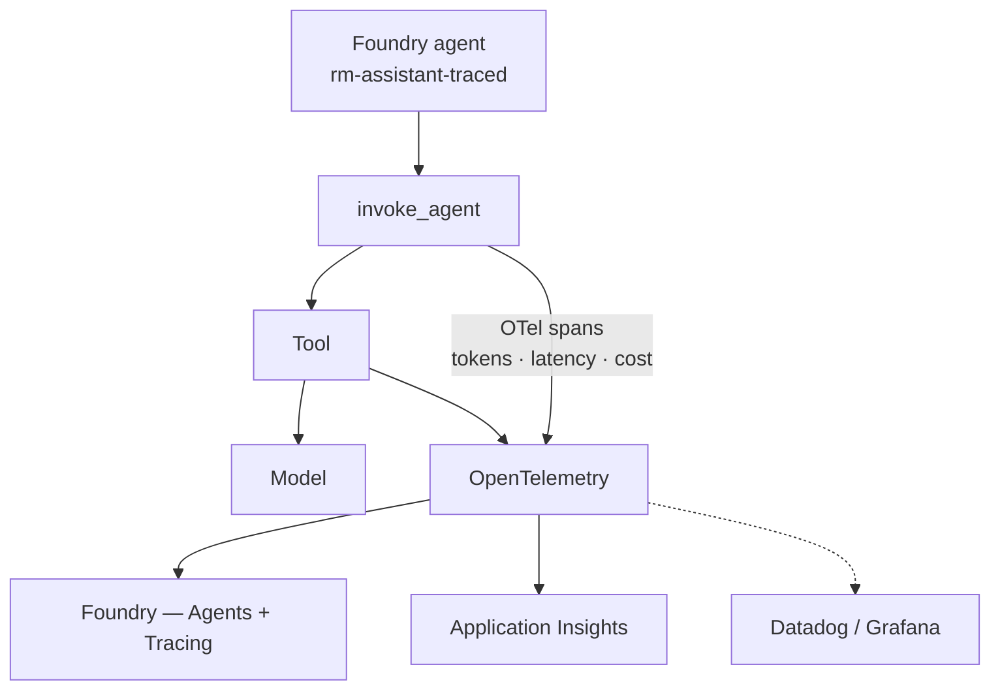
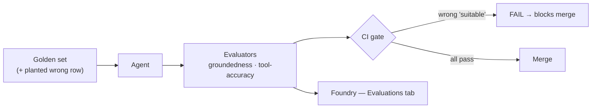
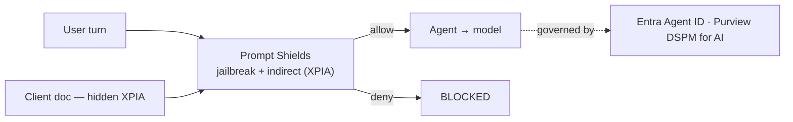
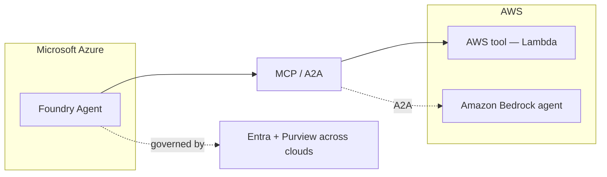

# Foundry Pattern Library — "From AI Gateway to AI Factory"

Nine runnable Microsoft Foundry patterns, told through **one Private Banking scenario**
(a wealth-management Relationship Manager assistant), and positioned to run **alongside
AWS + your existing gateway** — not instead of them.

## The story

> **Build in GitHub → Run & optimize in Foundry → Reach users in M365.**
> A gateway gives you **model access**. Foundry gives you the **agent factory** — the
> runtime (Plan/Act/Observe), grounding (Microsoft IQ), identity, evaluation, tracing and
> safety plane *around* the models. **Keep your LiteLLM gateway. Keep AWS. Add the factory.**

Close on the Build 2026 triad: **Foundry** (platform) + **Citadel** (governance at scale,
Foundry + APIM) + **Agentic Patterns** (business value).

## Architecture at a glance

Foundry plugs in **behind** your gateway as just another provider — keyless via Entra ID —
then adds the factory plane (runtime, grounding, identity, eval, tracing, safety) the models alone don't give you.



## What's inside

| # | Folder | Pattern | Live demo move | Runnable? |
|---|--------|---------|----------------|-----------|
| 1 | `01-wedge/` | Wedge → AI Hub Gateway / Citadel | Foundry as a provider *behind* your Azure AI Gateway (APIM) | ✅ |
| 2 | `02-hosted-agents/` | Hosted Agent Service | Two hosting models — prompt-based (managed vector store + function tool) and a real BYO-code hosted agent — both with an Entra Agent ID | ✅ |
| 3 | `03-microsoft-iq/` | Microsoft IQ (Web IQ + Foundry IQ) | Governed Web IQ MCP tool (keyless via Foundry connection) + Azure AI Search grounding | ✅ (via skill-forge) |
| 4 | `04-agentic-loop/` | Agentic Loop — "Build Skills, Not Agents" | skill-forge: one loop, N skills; switch to **Copilot SDK BYOM** | ✅ (skill-forge) |
| 5 | `05-multi-agent/` | Multi-agent orchestration | **Agent Framework**: orchestrator + 2 specialists | ✅ |
| 6 | `06-observability/` | Observability & tracing | Same OpenTelemetry trace in **both** the Foundry portal *Tracing* tab **and** App Insights | ✅ |
| 7 | `07-evaluations/` | Evaluation → optimization | Scorecard + CI gate; a wrong row fails the gate | ✅ |
| 8 | `08-governance/` | Governance / Prompt Shields | Block a live jailbreak + XPIA injection; clean question passes (**live, keyless**) | ✅ |
| 9 | `09-aws-interop/` | AWS cross-cloud interop (the close) | Foundry agent → AWS tool over MCP/A2A (**slide + code walkthrough**) | 📖 code |

Every pattern folder has a `TALK-TRACK.md` — the 60-second script + "what it beats in a
homegrown factory." Plus `bedrock-vs-foundry.md` for the coexistence Q&A.

## Pattern diagrams

One architecture per pattern — the same diagrams that appear on each slide of
`foundry-patterns.pptx`.

### 1 · Wedge → AI Hub Gateway / Citadel
Keyless via Entra ID — 401 without a token, 200 with. Foundry sits beside Bedrock behind the gateway.



### 2 · Hosted Agent Service
**Two ways to run an agent on Foundry**, same Private Banking scenario, both with a
governable Entra Agent ID — see [`02-hosted-agents/`](02-hosted-agents/):
- **A. Prompt-based** (`create_agent.py`) — declarative: model + instructions + tools.
  Managed **vector store** (File Search RAG) + a **function tool**, created with the new
  unified SDK (`AIProjectClient.agents.create_version(PromptAgentDefinition(...))`) and
  invoked via the **Responses** API. A first-class *versioned* agent in the portal.
- **B. Hosted (BYO code)** ([`hosted/`](02-hosted-agents/hosted/)) — your **Agent
  Framework** container, run by Foundry on managed compute, with its own **dedicated**
  Entra Agent ID and endpoint (Responses protocol on `:8088`).



### 3 · Microsoft IQ — Web IQ + Foundry IQ
Web IQ is a **governed MCP tool connection** in Foundry — any client grounds through the
AI Gateway, keyless (the key stays in the connection, read at runtime via Entra).



### 4 · Agentic Loop — Build Skills, Not Agents
One Plan/Act/Observe loop, N skills-as-folders; swap the engine to Copilot SDK BYOM.



### 5 · Multi-agent Orchestration (Agent Framework)
Fan out to specialists concurrently, then aggregate — Compliance can return BLOCK.



### 6 · Observability & Tracing
Create a **real Foundry agent**, run one traced turn, and the same OTel trace lands in the Foundry portal (Agents + Tracing) **and** App Insights — portable, no lock-in.



### 7 · Evaluation → Optimization
Score the golden set in **Foundry's cloud eval service**; a wrong "suitable" answer fails groundedness and the CI gate blocks the PR. Results show in the terminal *and* the Foundry **Evaluations** tab.



### 8 · Governance / Prompt Shields / Content Safety
Prompt Shields blocks a direct jailbreak and an injection hidden in a client document, while a clean question passes — **live and keyless** on the Foundry AI Services account (no separate resource).



### 9 · AWS Cross-cloud Interop (the close)
A Foundry agent calls an AWS tool over MCP (mock Lambda); A2A hands off to a Bedrock agent.



## Setup (uv)

```powershell
cp .env.example .env      # values are pre-filled for the Foundry project
uv sync                   # resolves Python 3.12 + deps automatically
az login                  # Entra ID auth (DefaultAzureCredential) — gateway + Foundry
```

Auth is **Entra ID / keyless** everywhere: the gateway client (Pattern 1/5) and the
Foundry project both use `DefaultAzureCredential`, so `az login` is all you need. Set
keys in `.env` only if you prefer key-based fallback.

> **Multi-tenant tip:** `.env` pins `AZURE_TENANT_ID` to the Foundry resource's tenant.
> If you're signed into more than one tenant, this stops `DefaultAzureCredential` from
> grabbing a token for the wrong one (a "token tenant does not match resource tenant"
> error the eval workers in Pattern 7 are sensitive to). Tenant IDs aren't secrets.

Run any pattern:

```powershell
uv run python 01-wedge/call_gateway.py
uv run python 02-hosted-agents/create_agent.py
# ... etc
```

Patterns 3 + 4 run from the **skill-forge** repo (`../skill-forge`): `uv run skill-forge`,
then use the engine selector (hand-rolled loop → Copilot SDK → Copilot SDK BYOM → Agent
Framework) and the skill chips.

## Suggested run-of-show (60 min)

| Time | Pattern | Point to land |
|------|---------|---------------|
| 0–5 | 1 Wedge | Disarm the AWS objection: Foundry plugs in *behind* your gateway |
| 5–15 | 2 Hosted + 3 Microsoft IQ | Managed runtime; grounding AWS can't match |
| 15–25 | 4 Agentic loop + 5 Multi-agent | Skills-in-one-loop; multi-agent *when* it earns it |
| 25–33 | 6 Observability | Create a Foundry agent, run one traced turn; show it in the **portal Agents + Tracing** *and* App Insights; OTel = no lock-in |
| 33–41 | 7 Evaluations | Score the same agent; the wrong row fails the CI gate |
| 41–50 | 8 Governance | The closer: block a live injection; Entra Agent ID + Purview |
| 50–60 | 9 AWS interop + Q&A | Coexistence: Bedrock runs *an agent*; Foundry runs the *factory* |

## Live-demo safety
- **Pre-run every script once** and keep terminal output / portal screenshots as fallback.
- Keep the Foundry portal **Agents** (versioned `rm-assistant-prompt`) and **Tracing** tabs pre-opened.
- Secrets live in `.env`, never on screen.
